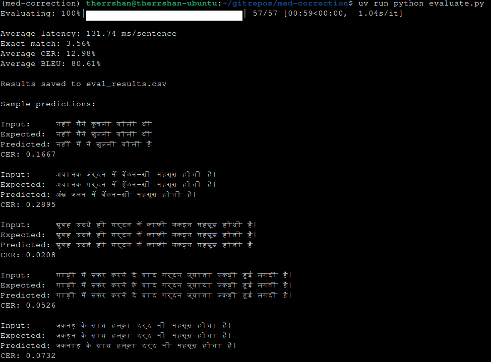

# Hindi Medical Text Correction System

## Dataset Generation

### Overview
Created a synthetic dataset of 10,000+ Hindi medical sentence pairs (noisy input → clean target) to simulate realistic ASR errors in medical conversations.

### Data Sources

**Base Corpus Generation** (`corpus.py`)
- Generated 10,000+ unique Hindi medical sentences using two strategies:
  - **Template-based generation (60%)**: 32 sentence templates covering common medical scenarios (pain descriptions, symptom reports, multiple symptoms, duration expressions, questions)
  - **Curated sentences (40%)**: 100+ handcrafted complete medical sentences covering diverse medical vocabulary
- Templates use placeholder variables filled from medical vocabulary banks:
  - Body parts (30 terms): पेट, सिर, गले, छाती, पैर, हाथ, etc.
  - Pain types (10 terms): दर्द, जलन, खुजली, सूजन, ऐंठन, etc.
  - Symptoms (17 terms): बुखार, खांसी, उल्टी, चक्कर, etc.
  - Time expressions, actions, diseases, adjectives
- Ensured diversity by combining sentences when needed to reach target count

### Noise Injection Strategy

**Realistic ASR Error Simulation** (`noise.py`)
Implemented multiple noise types to mimic real Hindi ASR errors:

1. **Phonetic Confusions** (40% of corruptions)
   - क↔ख, प↔फ, स↔श↔ष, र↔ड, इ↔ई, ए↔ऐ

2. **Visual Similarity Confusions** (20% of corruptions)
   - र↔ड, व↔ब, ध↔घ, भ↔म

3. **Matra Errors** (20% of corruptions)
   - Missing or wrong vowel signs: ा, ि, ी, ु, ू, े, ै, ं, ँ, ्

4. **Medical Term Corruptions** (20% of corruptions)
   - दर्द→डर्ड, पेट→पेन, खांसी→काशी, पैर→पाइर

5. **Spacing Errors** (15% probability)
   - "पेट में" → "पेटमें", "खांसी" → "खां सी"

### Curriculum Learning Approach

**Multi-Difficulty Training** (`create_curriculum_samples`)
For each clean sentence, generated 2-3 noisy variants with increasing difficulty:
- **Easy variant** (0.5x intensity): 1-2 character corruptions per sentence
- **Medium variant** (1.0x intensity): 2-3 corruptions, mixed noise types
- **Hard variant** (1.5x intensity): 3-5 corruptions, compound errors

Base noise intensity set at 12-15% per word, modulated by difficulty multiplier.

### Dataset Composition

Generated dataset contains:
- **10,000+ training pairs** total
- **85% noisy samples** requiring correction
- **15% clean samples** (no correction needed) to prevent over-correction
- **2-3 variants per base sentence** for robustness

**Noise Distribution:**
- Single-character phonetic errors: ~35%
- Medical term corruptions: ~25%
- Matra/vowel sign errors: ~20%
- Multi-character errors: ~15%
- Spacing errors: ~5%


**Output Format:**
```csv
input,target
"मझु े पेन में गड़बड़ है","मझु े पेट में गड़बड़ है"
"उन्हें काशी और गले में डर्ड है","उन्हें खांसी और गले में दर्द है"
```

### Why This Approach?

**Advantages:**
- Controlled noise injection replicates realistic ASR errors
- Medical-specific corruptions capture domain patterns
- Curriculum learning improves model robustness
- No-correction samples prevent hallucination
- Phonetically-grounded errors match Hindi phonology

**Limitations:**
- Synthetic data may not capture all real ASR edge cases
- Limited to common medical vocabulary that is hardcoded into generation.
- Simplified sentence structures compared to conversational speech.

This approach provides a strong foundation for learning correction patterns while maintaining linguistic authenticity for Hindi medical text.

**Note on AI Tool Usage:** 
AI assistance (Claude) was used to generate the hardcoded vocabulary lists and sentence templates in corpus.py and the phonetic/visual confusion mappings in noise.py. All code logic, training pipeline, and model implementation were written independently.

---

## Model Training

### Model Selection: ByT5-Small

Chose **Google's ByT5-small** (byte-level T5) as the correction model. It works directly on UTF-8 bytes without language-specific tokenizers, handles character-level errors without OOV issues, and provides fast inference with 300M parameters (~1.2GB memory).

**Why not alternatives?**
- mT5/mBART: Larger models (580M-1.2B params), slower inference, subword tokenization struggles with character-level errors
- Indic BERT variants: Encoder-only, requires additional decoder head, not designed for generation
- GPT-based models: Autoregressive = slower, harder to constrain output length

### Training Configuration

**Hyperparameters:**
```python
Model: google/byt5-small (300M params)
Max sequence length: 196 tokens
Batch size: 16
Learning rate: 2e-5
Epochs: 5
Optimizer: AdamW
Gradient clipping: 1.0
Train/val split: 95/5
```

**Stability measures:**
- No FP16/BF16 (prevents NaN issues on character-level sequences)
- Gradient clipping at 1.0 (prevents exploding gradients)
- Conservative learning rate (2e-5)
- Padding tokens masked with -100 (ignored in loss)


### Model Architecture

ByT5-small encoder-decoder:
- **Encoder**: 12 layers, 512 hidden dim, 6 attention heads
- **Decoder**: 12 layers, 512 hidden dim, 6 attention heads  
- **Vocab size**: 384 (UTF-8 bytes + special tokens)
- **Parameters**: 300M total

Input: Byte-encoded noisy Hindi text
Output: Byte-encoded corrected Hindi text

Training objective: Cross-entropy loss on target sequence

### Training Time & Resources

**Hardware requirements:**
- GPU: 8GB VRAM minimum (tested on T4)
- RAM: 16GB system memory
- Storage: 5GB (model checkpoints + dataset)

**Training time:**
- ~12k samples, 5 epochs = ~2-3 hours on single T4 GPU

## Inference System

### Architecture

Built a two-stage correction pipeline combining neural correction with learned feedback:

**Stage 1: Rule-based Pre-cleaning**
- SQLite database stores common word-level mistakes learned from feedback
- Pre-processes input by replacing known wrong words with corrections
- Acts as a fast lookup layer before neural model

**Stage 2: Neural Correction**
- ByT5 model corrects remaining errors
- Beam search with beam_width=4 for multiple correction candidates
- Generates corrected text with confidence

### Feedback Learning Loop

The system learns from golden corrections through an interactive feedback mechanism:

When provided with golden correction:
1. User identifies wrong word: "काशी"
2. User provides correct form: "खांसी"
3. System stores in database: काशी → खांसी
4. Future inputs with "काशी" get pre-corrected before neural model

**Note:** This is a naive prototype demonstrating the feedback loop concept. In production, you'd want proper golden correction storage, model fine-tuning on accumulated feedback, and more sophisticated word-level alignment instead of simple dictionary lookup.

### Interactive CLI

```bash
python inference.py
```

CLI workflow:
1. Enter noisy Hindi sentence
2. View model prediction
3. Optionally provide word-level corrections
4. System learns and stores corrections
5. Repeat

### Database Schema

```sql
CREATE TABLE mistakes (
    id INTEGER PRIMARY KEY,
    wrong TEXT UNIQUE,
    correct TEXT
)
```

Stores word-level mappings with automatic upsert on conflicts.

### Performance Characteristics

**Inference speed:**
- Single sentence: ~131.7 ms on GPU
- Pre-cleaning overhead: <5ms per sentence

**Memory usage:**
- Model: ~1.2GB GPU/RAM
- Database: <10MB for thousands of corrections
- Total: ~1.5GB working memory

---

## Evaluation

### Metrics

Evaluated on held-out `eval.csv` using three metrics:

1. **Exact Match Accuracy**: Percentage of predictions matching expected output exactly
2. **Character Error Rate (CER)**: Edit distance normalized by reference length
3. **BLEU Score**: Character-level BLEU with smoothing

### Evaluation Process


Pipeline applies two-stage correction (dictionary → neural model) to each test sample, then computes metrics.

### Results

**Performance:**
```
Exact Match: 3.56%
Average CER: 12.98%
Average BLEU: 80.61%
Latency: 131.7 ms/sentence
```



*Terminal output showing evaluation metrics and sample predictions*


Output saved to `eval_results.csv` with per-sample metrics and predictions.

---

## Discussion & Analysis

### Understanding the Metrics Gap

1. **Character-level precision matters**: Even a single wrong character (e.g., missing anusvara `ं` or wrong matra) fails exact match, but barely affects CER/BLEU.

2. **Minor spacing/punctuation differences**: Model might add/remove spaces inconsistently.

3. **Deterministic vs probabilistic**: Exact match requires perfect reproduction, while CER/BLEU are forgiving of minor variations

4. **Evaluation set characteristics**: Eval samples have complex sentences and rare vocabulary not seen in training, model gets "close enough" but not perfect.

### System Limitations

**Current bottlenecks:**
- Synthetic training data doesn't capture all real ASR error patterns
- Small model (300M params) has limited capacity for complex corrections
- Rule-based feedback is word-level only, doesn't handle multi-word errors

**Failure modes:**
- Under-correction: Misses subtle errors in complex medical terms
- Inconsistent spacing and punctuation handling
- Struggles with rare vocabulary outside training distribution

**What would improve this?**
- Train on real ASR output data (not synthetic)
- Fine-tune on domain-specific medical conversations
- Larger model (ByT5-base or mT5) for better capacity
- Sentence-level confidence scoring to detect low-quality predictions
- Post-processing rules for spacing normalization
- Active learning loop with continuous retraining on feedback

### Production Considerations

This is a prototype demonstrating feasibility. For production deployment:
- Replace naive dictionary with proper alignment and model fine-tuning
- Add confidence thresholds to flag uncertain corrections for human review
- Build monitoring for model drift and correction quality over time
- Scale inference with batching and model quantization for latency